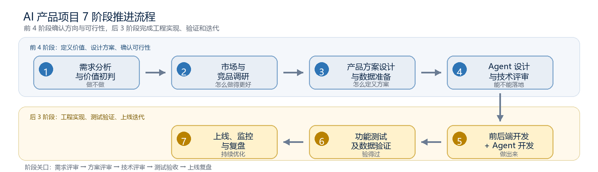

# AI Document to Project

> 将 Excel 等业务文档转换为可预览、可校验、可创建的结构化项目计划。

这是一个脱敏后的 AI 产品项目作品集，展示我如何把“文档转项目”从模型能力验证推进到可评测、可交付的产品方案。仓库包括产品案例、Agent 架构、评测体系、可运行 Demo，以及由 Python 生成的项目推进与复盘文档。



## 招聘方 3 分钟阅读路径

1. 打开 [文档中心](docs/README.md)：按推荐顺序浏览全部材料。
2. 阅读 [项目案例复盘](docs/01-case-study.md)：了解业务问题、关键决策、版本结果与复盘。
3. 阅读 [Agent 架构设计](docs/02-architecture.md)：了解为什么采用“Code 确定性生成 + LLM 语义质检”。
4. 阅读 [评测与上线门槛](docs/03-evaluation.md)：了解自动评测、人工复核和灰度决策如何闭环。
5. 运行 [公开 Demo](src/document_to_project_demo.py)：查看表格抽取结果如何映射为项目层级 JSON。
4. 运行 [公开 Demo](src/document_to_project_demo.py)：查看表格抽取结果如何映射为项目层级 JSON。

## 项目解决的问题

业务团队常用表格维护项目计划、任务清单和活动排期，但迁移到项目管理工具时需要重复建项目、分组和录入任务。本项目将这条链路缩短为：

```text
上传业务文档
  -> 解析表格事实
  -> 生成结构化项目
  -> 规则校验与 AI 质检
  -> 用户预览、编辑、确认
  -> 创建项目
```

产品目标不只是“模型能生成 JSON”，还包括：

- 结构正确：项目、模块、卡片、任务层级稳定。
- 结果可追溯：生成节点可以回到源表行和字段。
- 体验可控制：支持预览、编辑、后台执行和结果恢复。
- 质量可量化：自动指标与人工业务判断共同决定是否上线。
- 失败可处理：明确 warnings、降级策略和人工确认边界。

## 关键设计

### 1. 确定性与智能能力分层

全量任务由代码根据文档事实源生成，LLM 只负责语义质检、异常解释和有限修正，避免让模型反复重建整张表造成漏项、增项和名称漂移。

### 2. 预览优先

先生成可编辑的项目骨架，再由用户确认创建。相较完全依赖多轮对话，这种方式能降低等待焦虑，并让用户对 AI 结果保持控制。

### 3. AI + 人工联合评测

自动评测负责 schema 合规、节点覆盖率、字段命中率和稳定性；人工复核负责层级合理性、业务语义和真实可用性。自动高分不直接等于可上线。

## 脱敏评测快照

一次 v0.3 内部回归共覆盖 20 个不同复杂度样例：

| 指标 | 结果 |
| --- | ---: |
| AI 自动评测平均分 | 89.5 / 100 |
| 人工复核平均分 | 83.1 / 100 |
| 人工结论 | 13 通过 / 2 有条件通过 / 5 不通过 |
| 与上一版本共有的 10 个样例 | 人工均分 76.6 → 88.0 |
| 平均生成耗时 | 40.1 秒 |

这组数据暴露出一个重要问题：自动评测对 Card 分组、父子关系和业务可用性的识别仍偏乐观。因此版本结论是“继续修复和回归”，而不是只看平均分直接对外发布。详见 [评测与上线门槛](docs/03-evaluation.md)。

## 公开 Demo

Demo 不包含生产接口或客户数据，只复现项目中的核心工程思想：先通过确定性规则完成全量节点映射，再输出 warnings 供后续质检。

```powershell
python src/document_to_project_demo.py `
  examples/sample_input.json `
  --output examples/generated_project.json
```

运行测试：

```powershell
python -m unittest discover -s tests -v
```

Demo 输入是已抽取的表格行：

```json
{
  "project_name": "新品发布计划",
  "rows": [
    {
      "module": "筹备阶段",
      "card": "内容准备",
      "task": "完成发布文案",
      "owner": "内容负责人",
      "start_date": "2026-07-01",
      "end_date": "2026-07-03"
    }
  ]
}
```

输出为可消费的项目层级 JSON，并附带覆盖率、默认分组使用情况和日期异常等校验信息。

## 仓库结构

```text
.
├── assets/                         # 流程图与文档插图
├── docs/
│   ├── README.md                   # 文档导航与格式说明
│   ├── 01-case-study.md            # 项目案例与版本复盘
│   ├── 02-architecture.md          # Agent 分层与数据流
│   ├── 03-evaluation.md            # 评测指标与上线门槛
│   ├── guides/                     # GitHub 可在线预览的 PDF
│   └── source/                     # 可下载编辑的 Word 源文件
├── examples/                       # 脱敏输入与预期输出
├── src/
│   ├── document_to_project_demo.py # 公开可运行的映射 Demo
│   └── build_*.py                  # Word 文档与图示生成脚本
├── tests/
├── requirements.txt
└── README.md
```

## 文档工程化

仓库中的 Word 文档和流程图可由 Python 重建：

```powershell
python -m venv .venv
.\.venv\Scripts\Activate.ps1
pip install -r requirements.txt
python src/build_ai_product_sop.py
python src/add_stage_diagram.py
python src/build_ai_project_retro.py
```

Word 生成结果写入 `docs/source/`，图示写入 `assets/`。仓库同时在 `docs/guides/` 提供经过逐页检查的 PDF，方便直接在线预览。

> GitHub 不支持在代码页面直接渲染 `.docx`，因此 Word 文件页面只会显示 `View raw`；这不表示文档为空。需要在线阅读时请打开 PDF，需要编辑时再下载 Word 源文件。

## 边界说明

- 仓库为公开作品集，不包含原公司或客户的源文件、真实人员信息、内部域名、密钥、生产接口和完整后端代码。
- 样例、名称和数据均已抽象或脱敏；公开 Demo 用于解释设计思路，不等同于生产系统源码。
- 评测数据用于展示产品决策过程，不能代表所有文档类型和业务场景的普遍效果。
- 内容与代码在 AI 辅助下完成，由作者负责需求定义、方案判断、结构设计、校验与最终交付。
