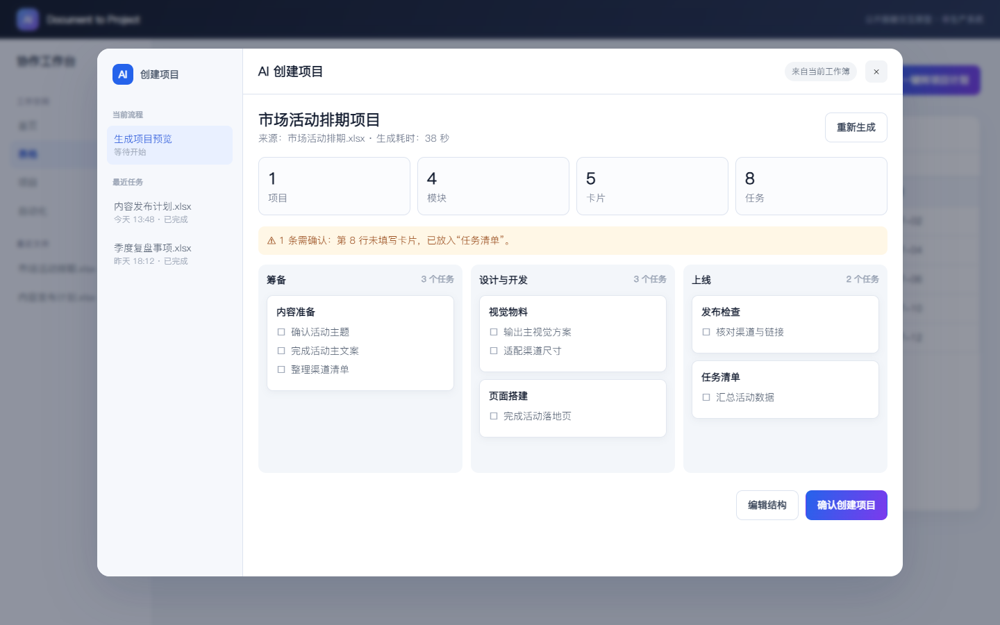
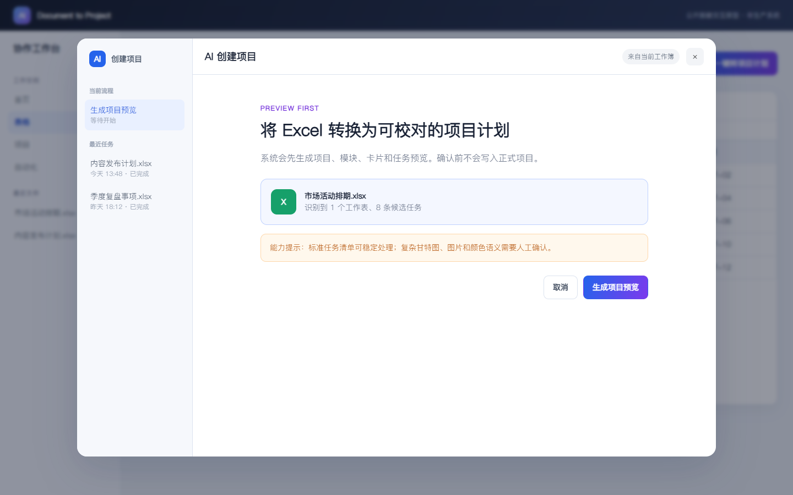
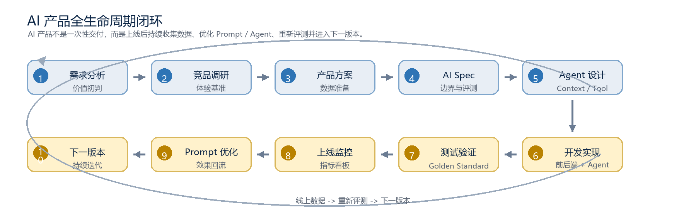

# AI Document to Project

> 把 Excel 任务计划转换为可预览、可校验、可追溯的结构化项目草稿。

[](https://github.com/184377817-prog/AI-Document-to-Project/actions/workflows/test.yml)


这是一个脱敏后的 AI 产品项目作品集，重点不是展示一段 Prompt，而是展示如何把“文档转项目”从能力验证推进为可评测、可恢复、可交付的产品方案。



## 招聘方 3 分钟阅读路径

1. 看 [项目案例复盘](docs/01-case-study.md)：业务问题、关键判断、版本结果与复盘。
2. 看 [交互原型截图](#交互原型)：预览优先、后台任务与确认创建如何落地。
3. 看 [公开版 PRD](docs/04-product-requirements.md) 与 [AI Specification](docs/05-ai-specification.md)：产品与 Agent 的协作边界。
4. 运行 [Excel 端到端 Demo](src/excel_to_project_demo.py)：验证 `.xlsx → 项目 JSON`。
5. 复算 [匿名评测结果](docs/06-evaluation-report.md)：验证指标和版本决策不是口头描述。

## 我的角色与贡献

| 项目项 | 说明 |
| --- | --- |
| 角色 | AI 产品经理 / Agent 方案设计 |
| 负责范围 | 需求定义、PRD、AI Spec、层级与字段规则、交互原型、评测体系、人工复核与版本决策 |
| 核心决策 | 采用“Code 确定性生成 + AI 语义质检”，并以可编辑预览承接模型不确定性 |
| 风险判断 | 自动均分接近 90 仍不直接发布；将自动/人工分歧和性能长尾纳入下一轮门槛 |
| 工程化补充 | 提供真实 `.xlsx` 输入、标准库解析器、项目 JSON 转换、匿名数据复算和自动测试 |

生产接口、内部 Prompt、客户文件和完整后端代码不在公开范围内。仓库使用抽象样例复现核心产品与工程思路。

## 项目解决什么问题

业务团队常用 Excel 管理排期和任务，但迁移到项目管理系统时需要重复建项目、分组和录入任务。本项目把流程缩短为：

```text
Excel
  → 读取单元格事实
  → 映射项目 / 模块 / 卡片 / 任务
  → 规则校验 + AI 语义质检
  → 用户预览与修改
  → 确认创建
```

产品目标不只是“能生成 JSON”：

- **结构正确**：节点层级稳定，不因模型重写整表而漏项或增项。
- **结果可追溯**：每个任务保留工作表和源行号。
- **体验可控**：生成可在后台继续，结果可恢复、可编辑。
- **质量可量化**：自动评测与人工业务复核共同决定是否发布。
- **失败可处理**：默认分组、日期冲突和能力边界都有明确 warning。

## 交互原型

原型是独立 HTML，不依赖后端。下载仓库后直接打开 `prototype/index.html` 即可体验上传、生成、最小化、恢复、预览和确认创建。

| 选择 Excel 并说明能力边界 | 生成项目预览 |
| --- | --- |
|  |  |

更多状态：

- [工作簿入口](assets/product/01-workbook-entry.png)
- [后台生成过程](assets/product/03-generating.png)
- [交互原型源码](prototype/index.html)

## 可运行的 Excel 端到端 Demo

仓库包含一个真实的 [示例 Excel](demo/sample_project_plan.xlsx)，日期使用可排序的日期单元格。转换器只依赖 Python 标准库读取 `.xlsx` 压缩包和 XML，再复用确定性层级映射：

```powershell
python src/excel_to_project_demo.py `
  demo/sample_project_plan.xlsx `
  --output demo/generated_project.json
```

输出包括：

- `project.modules[].cards[].tasks[]` 项目层级。
- `source_ref.sheet` 与 `source_ref.row` 来源定位。
- `coverage_rate`、默认分组计数和 warning。
- 稳定 ID、日期校验和空任务过滤。

也可从已标准化的 JSON 开始验证映射层：

```powershell
python src/document_to_project_demo.py `
  examples/sample_input.json `
  --output examples/generated_project.json
```

运行测试：

```powershell
python -m unittest discover -s tests -v
```

## 匿名评测证据

20 个脱敏样例的逐条结果位于 [evaluation/anonymized_results.csv](evaluation/anonymized_results.csv)，可使用标准库脚本复算：

```powershell
python evaluation/summarize_results.py
```

| 指标 | v0.3 结果 |
| --- | ---: |
| 自动评测平均分 | 89.5 / 100 |
| 人工复核平均分 | 83.1 / 100 |
| 人工结论 | 13 通过 / 2 有条件通过 / 5 不通过 |
| 自动通过但人工不通过 | 4 例 |
| 平均 / P95 / 最大耗时 | 40.1 / 73.4 / 252.5 秒 |

关键结论：自动高分不等于业务可用。分组、父子关系和可执行性需要人工判断；平均耗时也会掩盖严重长尾。因此版本结论是继续修复与灰度，而不是只看均分直接发布。详见 [匿名评测报告](docs/06-evaluation-report.md)。

## 核心设计

### 1. Code 与 AI 分层

全量节点由代码根据源事实稳定生成；AI 只负责表头语义、分组建议、命名检查与异常解释。最终写入前仍由代码校验 schema、权限和幂等性。

### 2. 预览优先

先生成可编辑草稿，再由用户确认创建。相比只依赖多轮对话，这更适合核对几十个任务，也能降低错误写入风险。

### 3. 自动评测 + 人工复核

自动侧覆盖 schema、覆盖率、字段命中和稳定性；人工侧判断层级、业务语义和真实可执行性。严重问题可以覆盖平均分，触发发布阻断。



## 文档导航

| 文档 | 重点 |
| --- | --- |
| [项目案例复盘](docs/01-case-study.md) | 背景、个人贡献、方案、数据与复盘 |
| [Agent 架构设计](docs/02-architecture.md) | Code / LLM 分工、数据流和状态机 |
| [评测与上线门槛](docs/03-evaluation.md) | 指标、复杂度分层和发布判断 |
| [公开版 PRD](docs/04-product-requirements.md) | 功能、异常、埋点和验收 |
| [公开版 AI Specification](docs/05-ai-specification.md) | 输入输出、字段规则和降级策略 |
| [匿名评测报告](docs/06-evaluation-report.md) | 逐条证据、复算方法与结论 |
| [文档中心](docs/README.md) | PDF / Word 成品与阅读说明 |

## 仓库结构

```text
.
├── assets/product/                # 脱敏原型截图
├── demo/                          # 真实 XLSX 示例
├── docs/                          # 案例、架构、PRD、AI Spec、评测
├── evaluation/                    # 匿名逐条数据、汇总脚本与结果
├── examples/                      # 标准化 JSON 输入输出
├── prototype/index.html           # 可交互产品原型
├── src/
│   ├── excel_to_project_demo.py   # XLSX → 项目 JSON
│   └── document_to_project_demo.py
├── tests/                         # 转换与评测复算测试
└── tools/build_demo_workbook.mjs  # 示例 Excel 的可重复构建脚本
```

## 公开边界

- 不包含真实客户文件、人员信息、内部域名、密钥、生产接口或完整后端代码。
- 样例名称与业务内容均已抽象；评测只保留不可反向识别的指标。
- 公开 Demo 用于解释设计和验证核心链路，不等同于生产系统源码。
- 内容与代码在 AI 辅助下完成，由作者负责需求、判断、校验与最终交付。
