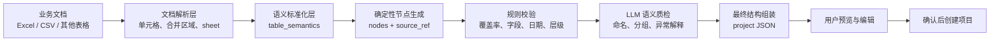
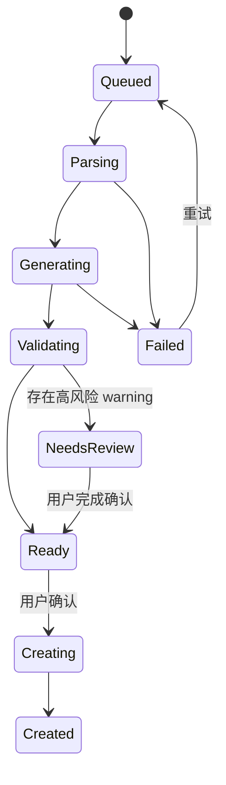

# Agent 架构设计

## 1. 设计目标

文档转项目不是普通文本生成任务。系统既要理解表格语义，又要保证任务不漏、不增、可追溯，并最终生成业务接口可以消费的稳定结构。

架构目标：

- 事实优先：任务名称、日期和负责人尽量来自源文档。
- 可追溯：每个节点可以关联到源 sheet、行和字段。
- 可校验：节点数、路径和字段可以自动复算。
- 可修复：局部错误不需要重新生成整个项目。
- 可控写入：AI 输出必须经过 schema 校验和用户确认。

## 2. 分层数据流



## 3. Code 与 LLM 的职责边界

| 能力 | Code | LLM |
| --- | --- | --- |
| 读取表格事实 | 主责 | 不直接修改事实 |
| 生成全量基础节点 | 主责 | 不重复重建 |
| schema、类型和必填校验 | 主责 | 辅助解释 |
| 节点覆盖率与路径匹配 | 主责 | 辅助判断歧义 |
| 分组语义与名称合理性 | 提供规则 | 主责质检 |
| 异常说明与追问建议 | 提供上下文 | 主责 |
| 最终创建入参 | 主责组装 | 不直接写入 |

这样设计的核心原因是：确定性操作应尽量交给代码，只有需要上下文语义判断的部分才交给 LLM。

## 4. 中间结构

生产系统可以使用扁平节点作为可校验中间层：

```json
{
  "node_id": "task-0001",
  "node_type": "task",
  "parent_node_id": "card-0001",
  "title": "完成发布文案",
  "owner": "内容负责人",
  "start_date": "2026-07-01",
  "end_date": "2026-07-03",
  "source_ref": {
    "sheet": "发布计划",
    "row": 12
  }
}
```

扁平节点的优势：

- 可直接统计源任务与生成任务的数量差。
- 可用 `parent_node_id` 校验父子关系。
- 可根据 `source_ref` 定位遗漏或错误字段。
- 修复一个节点时，不需要让模型重写完整 JSON。
- 最终可由代码稳定组装成嵌套项目结构。

## 5. 校验策略

### 5.1 结构校验

- 项目必须有名称。
- 模块、卡片和任务 ID 唯一。
- 任务必须有合法父节点。
- 空分组按规则移除或标记。
- 输出必须满足目标 schema。

### 5.2 事实覆盖

```text
任务覆盖率 = 已映射源任务数 / 可识别源任务总数
字段命中率 = 正确字段数 / Gold Standard 中有值字段数
路径准确率 = 正确完整路径数 / Gold Standard 路径总数
```

完整路径可以由“项目 / 模块 / 卡片 / 任务”组合，避免只匹配任务名称而忽略错误分组。

### 5.3 异常与 warnings

典型 warning：

- 缺少模块或卡片，使用默认分组。
- 开始日期晚于结束日期。
- 同名任务出现在同一路径。
- 负责人字段无法确定。
- 多个 sheet 都可能是主数据区。
- LLM 建议的分组与源文档层级冲突。

warning 不应被静默吞掉；它既服务于日志和评测，也可以在预览页转化为用户可理解的确认项。

## 6. 产品状态机



前端关闭不应终止后台任务。用户重新进入时，通过任务 ID 恢复当前状态和预览结果。

## 7. 公开 Demo 与生产系统的差异

[公开 Demo](../src/document_to_project_demo.py) 从“已抽取的表格行”开始，只演示确定性分组、ID 生成、日期检查和 warnings 输出：

- 不包含真实文件解析服务。
- 不调用外部模型。
- 不连接生产项目创建接口。
- 不包含客户 schema、内部域名、鉴权或部署配置。

它用于让读者快速验证架构中的确定性映射思想，而不是替代生产实现。
